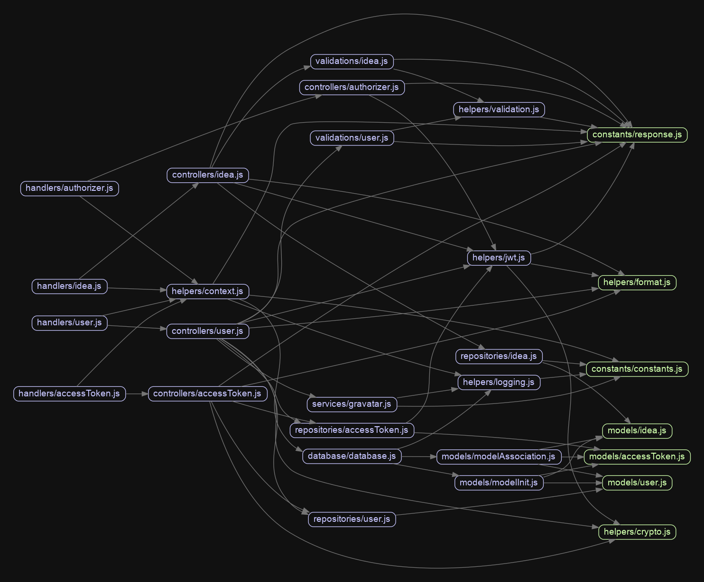

# My Idea Pool API

A backend API for a web-application which contains ideas sorted by an applied rating.

  
  <b style="font-size: 0.5em;">Dependency Graph</b>

## Development Setup

1. Install Node.js 8.10 because this is the version being used by the Serverless service

2. Install the Serverless globally via `npm install serverless -g`

3. Install yarn from https://yarnpkg.com

4. Install dependencies via `yarn install`

5. (optional) Run locally via `yarn serve`

## Tests

The tests can get run via `yarn test`.

## Deployment

1. Create an AWS account if you don't have one at [console.aws.amazon.com](https://console.aws.amazon.com)

2. Setup your credentials as described in [here](https://www.youtube.com/watch?v=arqv2YVp_3E)

3. Setup the database for the API. This database needs to be of a MySQL-type (Mysql, AWS Aurora, AWS Aurora Serverless, MariaDB).

4. Copy the file `.env/env.sample.yml` to `.env/env.yml`

5. Add the connection settings to the file `.env/env.yml`

6. Adjust all remaining settings in the file `.env/env.yml` to your needs

7. (Optional) Change the region from `eu-central-1` (Frankfurt, Germany) to your nearest AWS region in `serverless.yml`

8. (Optional) When using a private AWS RDS database, the vpc-access needs to get specified. This requires the following changes.

-   uncomment the setting `vpc: ${file(./.env/env.yml):vpc}` in the file `serverless.yml`

-   specify `vpc:securityGroupIds` and `vpc:subnetIds` in the file `.env/env.yml` with the values from your AWS RDS database

9. Deploy to the specific stage via `yarn deploy:test`. Stages can be either `test`, `dev` or `production`.

## Improvements

### Exisiting Test Framework

-   When expecting a decimal value like e.g. `1.0`, only accept the value `1` without the decimals as a returned result. The reason for this is that otherwise, the created stringified JSON isn't standard-compliant anymore. The behavior of enforcing unneeded decimals in responses can get enabled/disabled via the settings-flag `ENFORCE_DECIMALS` in `.env/env.yml`. By default, this behavior is disabled, but will create results, which are slightly different to what the Test API produces.

### Performance

-   Switch from snake-case (`my_json_field`) to camel-case (`myJsonField`) in order to save transferred data between the client and the API. The saved amount of transferred data depends on the project. However, the more numeric and boolean fields are included in the JSON-responses, the more the data-saving will be. On average, a saving of 15% transferred data is common.

### Security

-   Don't send cleartext passwords to the API. In order to fix this, the client needs to hash its password locally and then send the hash and not the password itself to the API.

-   On a logout destroy all sessions and not only the current one.

### Data Privacy

-   In order to comply with data privacy matters, there should always be a self-deletion process for the user. This would need an API-endpoint for self-deleting an authorized user.
